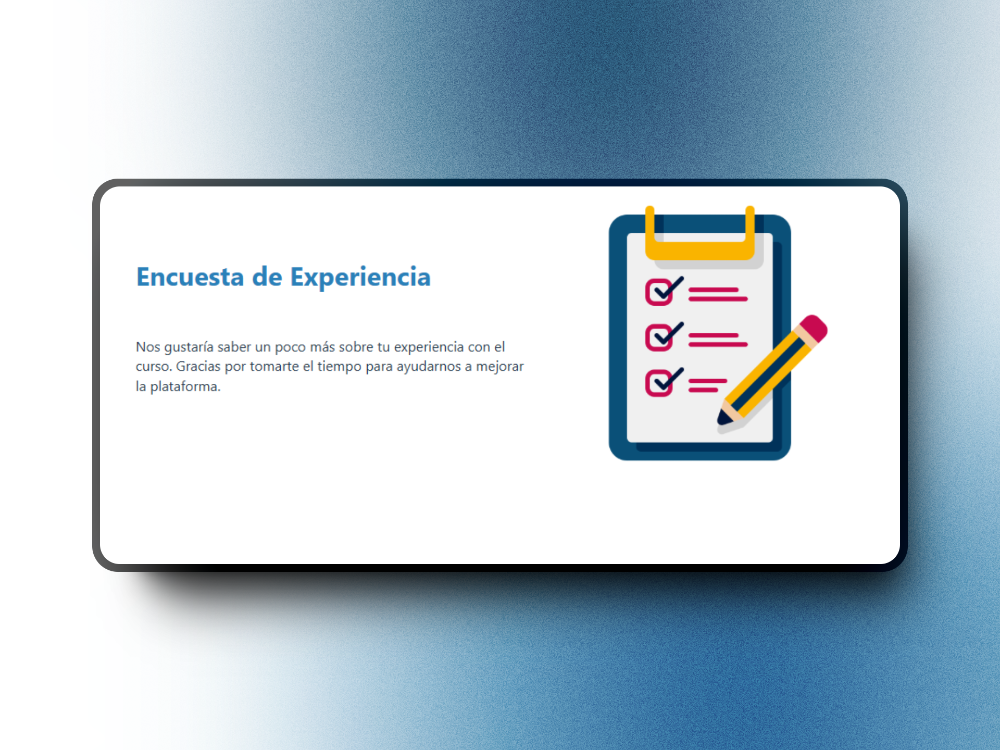

# Encuesta de Experiencia
Una interfaz de formulario de encuesta creada para el Proyecto de Diseño Web Responsivo de FreeCodeCamp: Construir un formulario de encuesta.  

Puedes ver la página en [Survey Form](https://codepen.io/GalloBruno/pen/xbKpjaj)  

Este proyecto tiene como objetivo recolectar la opinión de los usuarios sobre su experiencia de aprendizaje. Incluye campos para ingresar información personal y responder preguntas específicas sobre el curso.  