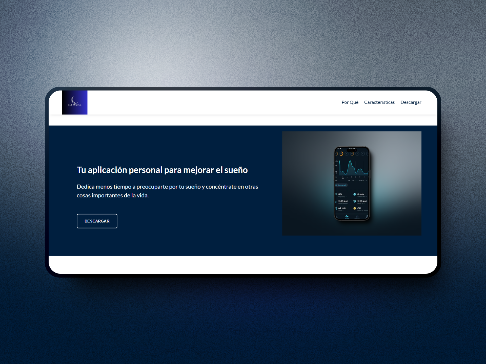

# Página de Aterrizaje del Producto
Una página de aterrizaje para una aplicación de recordatorio de medicación. Creada para el desafío de freeCodeCamp "Construir una Página de Aterrizaje de Producto".  
** La información proporcionada en la página no es real.  
Puedes ver la página en [Product Landing Page](https://codepen.io/GalloBruno/pen/VYZyOGL)  
Este proyecto tiene como objetivo proporcionar una página para una aplicación de recordatorio de sueño, destacando sus características y beneficios. Incluye secciones con información detallada y visualmente atractiva.  