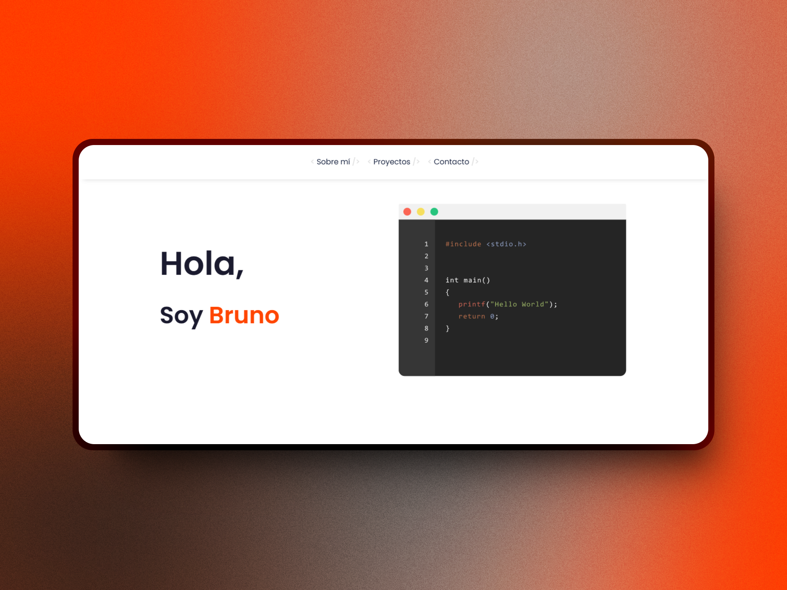

# Portafolio Personal
Una página de portafolio personal creada para el desafío de freeCodeCamp "Construir una Página de Portafolio Personal". 

Puedes ver la página en [Personal Portfolio](https://codepen.io/GalloBruno/pen/yyBpWrx)  

Este proyecto tiene como objetivo mostrar mis habilidades y proyectos como desarrollador web. Incluye secciones sobre mi experiencia, proyectos destacados y formas de contacto.  