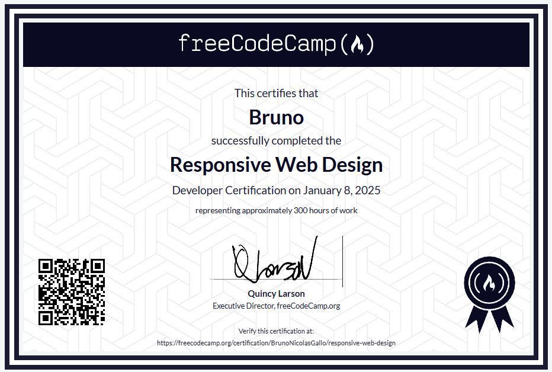

# Proyectos de Diseño Web Responsivo

[freeCodeCamp.org](https://www.freecodecamp.org/) es una organización sin fines de lucro que ayuda a miles de personas a aprender a programar de forma gratuita. Este repositorio captura mis soluciones personales a los proyectos de diseño web responsive.  

## Proyectos

Estos proyectos están hechos para la Certificación de Diseño Web Responsivo de freeCodeCamp. El objetivo es usar HTML y CSS puro para construir cinco páginas web responsive que cumplan con los requisitos de freeCodeCamp. Podes encontrar más información sobre los proyectos en los enlaces a continuación.

* **Página de Tributo**: [Página](https://codepen.io/GalloBruno/pen/YPKYLQJ) | [Requisitos](https://www.freecodecamp.org/learn/responsive-web-design/responsive-web-design-projects/build-a-tribute-page)
* **Formulario de Encuesta**: [Página](https://codepen.io/GalloBruno/pen/xbKpjaj) | [Requisitos](https://www.freecodecamp.org/learn/responsive-web-design/responsive-web-design-projects/build-a-survey-form)
* **Página de Aterrizaje de Producto**: [Página](https://codepen.io/GalloBruno/pen/VYZyOGL) | [Requisitos](https://www.freecodecamp.org/learn/responsive-web-design/responsive-web-design-projects/build-a-product-landing-page)
* **Página de Documentación Técnica**: [Página](https://codepen.io/GalloBruno/pen/raBpvdz) | [Requisitos](https://www.freecodecamp.org/learn/responsive-web-design/responsive-web-design-projects/build-a-technical-documentation-page)
* **Portafolio Personal**: [Página](https://codepen.io/GalloBruno/pen/yyBpWrx) | [Requisitos](https://www.freecodecamp.org/learn/responsive-web-design/responsive-web-design-projects/build-a-personal-portfolio-webpage)

 

Obtenido en [freeCodeCamp](https://freecodecamp.org/) por completar el curso de **Responsive Web Design**.
